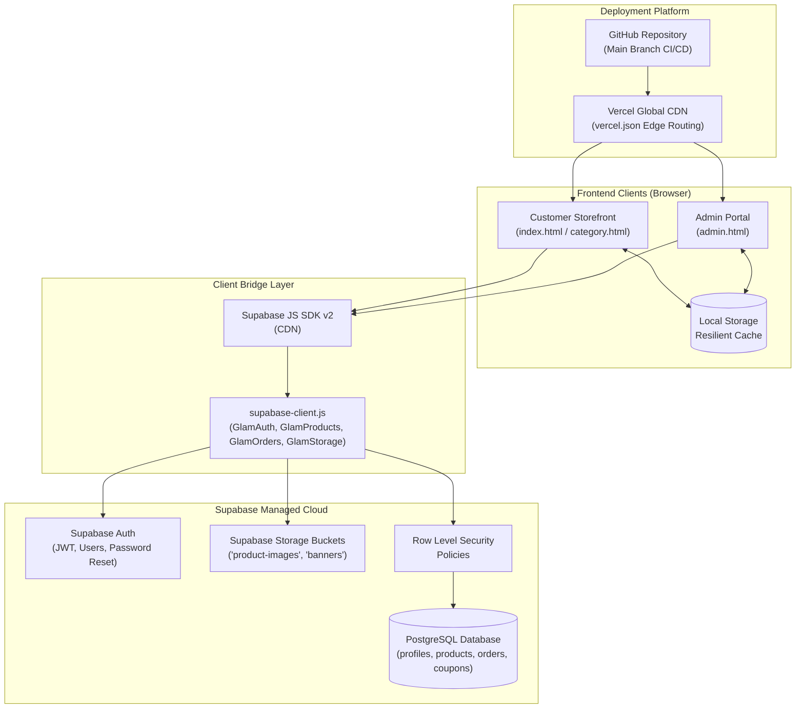

# SA GLAM & GRACE — COMPLETE TECHNICAL DOCUMENTATION
**Luxury Indian Women's Ethnic Fashion Storefront & Executive Admin Portal**

---

## 1. Executive Summary & System Architecture

### 1.1 Project Overview
**SA Glam & Grace** is an enterprise-grade luxury e-commerce web platform specializing in Indian women's ethnic couture (Kurtis, Sarees, Lehengas, Anarkalis, and Gowns). The platform consists of two integrated applications:
1. **Customer-Facing Storefront (`index.html`, `category.html`)**: A luxury shopping experience featuring interactive product showcases, dynamic filtering, interactive size and color selection, real-time slide-out cart, persistent wishlist drawer, instant checkout modal, and customer authentication with self-service password recovery.
2. **Executive Admin Portal (`admin.html`)**: A management dashboard providing real-time sales KPIs, interactive Chart.js analytics, inventory CRUD controls with direct Supabase Storage photo uploads, customer CRM, coupon promotion engines, and order fulfillment workflows.

### 1.2 Technology Stack
* **Frontend**: Vanilla HTML5, CSS3 (Custom Design System with CSS variables, Glassmorphism, animations), Vanilla JavaScript (ES6+ modular architecture).
* **UI Libraries & Assets**: [Remix Icon CDN](https://cdn.jsdelivr.net/npm/remixicon@3.5.0/fonts/remixicon.css), [Google Fonts](https://fonts.googleapis.com) (Cormorant Garamond, Inter, Poppins), [Chart.js](https://cdn.jsdelivr.net/npm/chart.js).
* **Backend & Cloud (BaaS)**: [Supabase](https://supabase.com) (PostgreSQL 15+, Supabase Auth with JWT, Supabase Storage for assets, Row-Level Security).
* **Local Development Server**: Lightweight Node.js HTTP static server (`server.js` / `server.cjs`).
* **Source Control**: Git & GitHub.
* **Production Hosting**: Vercel Edge Global CDN.

### 1.3 High-Level Architecture Diagram



---

## 2. Database Architecture (Supabase PostgreSQL)

### 2.1 Setting Up Supabase from Scratch
1. Navigate to [Supabase](https://supabase.com) and create an account or sign in.
2. Click **New Project**, choose your organization, name the project `sa-glam-grace`, set a secure database password, and select the closest region.
3. Once provisioned, navigate to **Project Settings -> API** to copy:
   * **Project URL**: e.g. `https://<project-ref>.supabase.co`
   * **Anon / Public Key**: `eyJhbGciOi...`
4. Add these credentials into your `.env` file and `supabase-client.js`.

### 2.2 Relational Database Schema
Execute the following schema in the **Supabase SQL Editor** (`supabase-schema.sql`):

```sql
-- 1. PROFILES TABLE (Linked with Supabase Auth users)
CREATE TABLE IF NOT EXISTS public.profiles (
  id UUID PRIMARY KEY REFERENCES auth.users(id) ON DELETE CASCADE,
  full_name TEXT,
  email TEXT,
  phone TEXT,
  role TEXT DEFAULT 'customer' CHECK (role IN ('customer', 'admin')),
  avatar_url TEXT,
  created_at TIMESTAMPTZ DEFAULT now()
);

-- Trigger to automatically create a profile record when a new user signs up
CREATE OR REPLACE FUNCTION public.handle_new_user()
RETURNS trigger AS $$
BEGIN
  INSERT INTO public.profiles (id, full_name, email, role)
  VALUES (
    new.id,
    COALESCE(new.raw_user_meta_data->>'full_name', 'Customer'),
    new.email,
    COALESCE(new.raw_user_meta_data->>'role', 'customer')
  )
  ON CONFLICT (id) DO NOTHING;
  RETURN new;
END;
$$ LANGUAGE plpgsql SECURITY DEFINER;

CREATE TRIGGER on_auth_user_created
  AFTER INSERT ON auth.users
  FOR EACH ROW EXECUTE FUNCTION public.handle_new_user();

-- 2. PRODUCTS TABLE (Inventory & Catalog)
CREATE TABLE IF NOT EXISTS public.products (
  id TEXT PRIMARY KEY,
  name TEXT NOT NULL,
  category TEXT NOT NULL,
  price NUMERIC NOT NULL,
  original_price NUMERIC,
  stock INTEGER DEFAULT 0,
  status TEXT DEFAULT 'in-stock',
  image TEXT,
  rating NUMERIC DEFAULT 5.0,
  sales INTEGER DEFAULT 0,
  created_at TIMESTAMPTZ DEFAULT now()
);

-- 3. ORDERS TABLE (Order Master)
CREATE TABLE IF NOT EXISTS public.orders (
  id TEXT PRIMARY KEY,
  user_id UUID REFERENCES auth.users(id) ON DELETE SET NULL,
  customer_name TEXT NOT NULL,
  customer_email TEXT NOT NULL,
  customer_phone TEXT,
  shipping_address TEXT,
  items_summary TEXT,
  total NUMERIC NOT NULL,
  payment_method TEXT DEFAULT 'UPI / Card',
  payment_status TEXT DEFAULT 'Paid',
  status TEXT DEFAULT 'Processing',
  created_at TIMESTAMPTZ DEFAULT now()
);

-- 4. ORDER ITEMS TABLE (Line Items)
CREATE TABLE IF NOT EXISTS public.order_items (
  id BIGSERIAL PRIMARY KEY,
  order_id TEXT REFERENCES public.orders(id) ON DELETE CASCADE,
  product_id TEXT,
  name TEXT NOT NULL,
  price NUMERIC NOT NULL,
  qty INTEGER NOT NULL DEFAULT 1,
  size TEXT,
  color TEXT,
  image TEXT,
  created_at TIMESTAMPTZ DEFAULT now()
);

-- 5. CUSTOMERS DIRECTORY TABLE (CRM)
CREATE TABLE IF NOT EXISTS public.customers (
  id TEXT PRIMARY KEY,
  name TEXT NOT NULL,
  email TEXT NOT NULL,
  phone TEXT,
  orders_count INTEGER DEFAULT 0,
  total_spend NUMERIC DEFAULT 0,
  status TEXT DEFAULT 'Active',
  created_at TIMESTAMPTZ DEFAULT now()
);

-- 6. COUPONS TABLE (Promotions & Discounts)
CREATE TABLE IF NOT EXISTS public.coupons (
  id TEXT PRIMARY KEY,
  code TEXT UNIQUE NOT NULL,
  type TEXT DEFAULT 'percentage',
  value NUMERIC NOT NULL,
  min_spend NUMERIC DEFAULT 0,
  usage_limit INTEGER DEFAULT 100,
  used_count INTEGER DEFAULT 0,
  status TEXT DEFAULT 'active',
  created_at TIMESTAMPTZ DEFAULT now()
);
```

### 2.3 Row Level Security (RLS) & Policies
To ensure security while enabling smooth client interactions:
* Enable RLS on all tables: `ALTER TABLE public.<table_name> ENABLE ROW LEVEL SECURITY;`
* Create read access policies for public catalog browsing (`SELECT USING (true)`).
* Allow customers to manage their own orders and update their profiles (`auth.uid() = id`).
* Allow the admin portal and checkout flow to create orders and update records with appropriate authorization checks.

### 2.4 Cloud Storage Buckets
Two public buckets are configured in Supabase Storage:
1. `product-images`: Stores high-resolution photography for catalog items uploaded via the Admin Portal.
2. `banners`: Stores seasonal promotional banners and hero assets.

Policies configured in Supabase Storage:
* Read: Public read access for any visitor (`bucket_id = 'product-images'`).
* Upload: Public or authenticated upload access allowed for admin catalog maintenance.

---

## 3. Frontend Architecture

### 3.1 Design System & Aesthetic Foundation (`style.css`, `admin.css`)
The frontend uses a cohesive design token system defined via CSS variables:
* **Primary Gold Accent**: `#C69214` / `#D4AF37` (Regal Indian couture aesthetic)
* **Secondary Jewel Tones**: Velvet Maroon (`#800020`), Emerald Peacock (`#097969`), Midnight Navy (`#1A2238`)
* **Neutral Backgrounds**: Warm Champagne Cream (`#faf7f0`, `#fdfbf7`), Soft Gray (`#f4f4f4`)
* **Typography**:
  * Serif Headings: `'Cormorant Garamond', Georgia, serif`
  * UI Text & Body: `'Inter', -apple-system, sans-serif`
  * Numbers & Accents: `'Poppins', sans-serif`
* **Micro-interactions**: Subtle scale on card hover, glassmorphic blur modals (`backdrop-filter: blur(8px)`), sliding drawer keyframe animations.

### 3.2 Key Pages & Modules

#### A. Main Storefront (`index.html` + `app.js`)
* **Hero Banner & Carousel**: High-impact visuals with call-to-action buttons directing users to seasonal collections.
* **Category Navigation**: Interactive cards for quick navigation to Kurtis, Sarees, Lehengas, and Anarkalis.
* **Product Grid**: Responsive grid displaying product photos, badges (e.g. "Bestseller", "20% OFF"), star ratings, prices, and quick action buttons.
* **Interactive Size & Color Selectors**: Allows customers to select sizes (`S`, `M`, `L`, `XL`, `XXL`, `Free Size`) directly on the card or in the quick-view modal.
* **Slide-Out Cart Drawer**:
  * Real-time item counter in navbar.
  * Line item adjustments (quantity increment/decrement, size review, item removal).
  * Subtotal calculation and promo discount computation.
* **Wishlist Drawer**: Independent sliding drawer with heart toggle animations and "Move to Bag" functionality.
* **Checkout Modal**:
  * Captures delivery address, phone number, and recipient details.
  * Payment method selection (UPI, Credit/Debit Card, Net Banking, COD).
  * Direct synchronization with `GlamOrders.create()` and immediate real-time inventory deduction.
  * **Strict Out-of-Stock Protection**: When ordered pieces reach the product's stock count (e.g. 15 ordered from 15 in stock), the remaining units drop to 0, status automatically changes to `'out-of-stock'`, a red **"SOLD OUT"** badge appears, "Add to Cart" and "Quick View" buttons are permanently disabled, and no further orders can be placed.
* **VIP Customer Authentication & Password Recovery**:
  * Login, registration, and "Forgot Password" self-service modal with instant recovery workflows.

#### B. Dedicated Category Showcase (`category.html` + `category.js`)
* Dynamic URL parameter parsing (e.g., `category.html?cat=Kurtis`).
* Dynamic filtering by price range slider, color filters, and size availability.
* Instant client-side sorting (Price: Low to High, High to Low, Customer Rating, Most Popular).
* Seamless sync with the global cart and wishlist.

#### C. Executive Luxury Admin Portal (`admin.html` + `admin.js`)
* **Executive KPI Cards**: Real-time Gross Revenue, Active Orders, Total Inventory Units, and Store Conversion Rate.
* **Interactive Sales Chart**: High-resolution 30-day revenue and order volume visualization powered by Chart.js.
* **Inventory Management**:
  * Interactive Product Modal with multi-photo gallery support.
  * Real-time file upload to Supabase Storage with instant image preview.
  * Stock count adjustments, categorization, discount pricing, size multi-checkboxes, and ethnic color tags.
* **Order Fulfillment Center**:
  * Status badges: `Processing`, `Shipped`, `Delivered`, `Cancelled`.
  * One-click status progression with persistent cloud update.
  * Printable invoice generator and CSV export.
* **Coupons & CRM Tabs**: Real-time management of active promo codes and customer spending records.

---

## 4. Backend & Cloud Integration

### 4.1 Architecture Strategy: Client-to-Cloud BaaS
Instead of maintaining a heavy backend monolithic server, the application uses modern Jamstack patterns:
* The client connects directly to **Supabase** via the official JS SDK loaded from CDN.
* For local development, a pure Node.js HTTP server (`server.js`) serves static assets with clean CORS and MIME handling.
* A resilience layer is built in: all data operations utilize **dual-layer persistence** (first attempting Supabase Cloud API, falling back gracefully to `localStorage` if network fails or credentials are unconfigured).

### 4.2 The Unified Client Service (`supabase-client.js`)
All database, authentication, and storage calls are encapsulated in `supabase-client.js`:

```javascript
// Initialization
window.sb = window.supabase.createClient(SUPABASE_URL, SUPABASE_ANON_KEY);

// 1. Authentication Service
window.GlamAuth = {
  signUp(email, password, fullName, phone, role)
  signIn(email, password)
  signOut()
  getCurrentUser()
  resetPasswordForEmail(email)
  updatePassword(newPassword)
};

// 2. Products Service
window.GlamProducts = {
  getAll()
  create(productData)
  update(id, updates)
  delete(id)
  bulkSeed(productsArray)
};

// 3. Orders Service
window.GlamOrders = {
  getAll()
  create(orderData, itemsArray)
  updateStatus(orderId, newStatus)
  delete(orderId)
};

// 4. Supabase Storage Service
window.GlamStorage = {
  uploadProductImage(file) // Uploads file to 'product-images' and returns public URL
  uploadBannerImage(file)
};
```

---

## 5. How Frontend and Backend Connect

### 5.1 Step-by-Step Connection Lifecycle

1. **SDK Injection**:
   ```html
   <!-- Load Supabase JS Client v2 from CDN -->
   <script src="https://cdn.jsdelivr.net/npm/@supabase/supabase-js@2"></script>
   <!-- Load Project Service Wrapper -->
   <script src="supabase-client.js"></script>
   ```

2. **Configuration Handshake**:
   `supabase-client.js` reads `window.SUPABASE_CONFIG` with the project URL and Anon Key. It instantiates `window.sb = window.supabase.createClient(...)`.

3. **Data Flow: Placing an Order**:
   ```
   [User Clicks "Place Order"]
              │
              ▼
   [Validate Checkout Inputs & Cart Items]
              │
              ▼
   [Call window.GlamOrders.create(orderPayload, items)]
              │
              ├──► Inserts into Supabase 'orders' table
              ├──► Inserts each item into 'order_items' table
              └──► Updates 'customers' table total spend
              │
              ▼
   [Clear Local Cart & Display Luxury Confirmation Modal]
   ```

4. **Data Flow: Admin Uploads Product Image**:
   ```
   [Admin Selects Photo in Product Modal]
              │
              ▼
   [File passed to window.GlamStorage.uploadProductImage(file)]
              │
              ▼
   [Direct multipart upload to Supabase Storage 'product-images']
              │
              ▼
   [Supabase returns Public CDN URL]
              │
              ▼
   [URL populated in Image URL field & saved in 'products' table]
   ```

---

## 6. How to Transfer the Project to Git & GitHub

### Step 1: Verify `.gitignore`
Make sure sensitive keys, build artifacts, and system files are excluded:
```gitignore
node_modules
.DS_Store
.env
```

### Step 2: Initialize Git Repository (if not already done)
Open your terminal in the project folder (`c:\Users\shame\doctor\style`):
```powershell
git init
```

### Step 3: Check Status and Stage Files
```powershell
git status
git add .
git commit -m "feat: complete SA Glam & Grace storefront, admin dashboard, supabase integration and documentation"
```

### Step 4: Create a Repository on GitHub
1. Log into [GitHub](https://github.com).
2. Click **New Repository** (+ icon top right).
3. Name the repository: `sa-glam-grace` (or your preferred repository name).
4. Set visibility to **Public** or **Private**.
5. Leave "Initialize with README", ".gitignore", and "License" **unchecked** (since your local repository already has files).
6. Click **Create repository**.

### Step 5: Link Local Repo to GitHub & Push
Copy the GitHub repository URL and execute:
```powershell
# Rename local branch to main
git branch -M main

# Link remote origin (replace with your repository URL)
git remote add origin https://github.com/<your-username>/sa-glam-grace.git

# Push code to GitHub
git push -u origin main
```

---

## 7. How to Deploy to Vercel (Step-by-Step)

### Method A: Deploy via GitHub (Recommended for Automated CI/CD)

1. **Sign Up / Log In to Vercel**:
   Go to [vercel.com](https://vercel.com) and sign in using your GitHub account.

2. **Import Git Repository**:
   * Click **Add New...** -> **Project**.
   * Find and select `sa-glam-grace` from your GitHub repository list.
   * Click **Import**.

3. **Configure Project Settings**:
   * **Framework Preset**: Select **Other**.
   * **Root Directory**:
     * If the files (`index.html`, `admin.html`) are in the root of the repository, leave it as `./`.
     * If the repository contains a subfolder (e.g. `style/`), click **Edit** and set Root Directory to `style`.
   * **Build and Output Settings**:
     * Build Command: Leave blank (no compilation required).
     * Output Directory: Leave default (`.` or root).

4. **Verify Routing Configuration (`vercel.json`)**:
   The repository includes a ready-to-deploy `vercel.json`:
   ```json
   {
     "version": 2,
     "cleanUrls": true,
     "trailingSlash": false,
     "rewrites": [
       { "source": "/", "destination": "/index.html" },
       { "source": "/admin", "destination": "/admin.html" },
       { "source": "/category", "destination": "/category.html" }
     ],
     "headers": [
       {
         "source": "/(.*)",
         "headers": [
           { "key": "X-Content-Type-Options", "value": "nosniff" },
           { "key": "X-Frame-Options", "value": "DENY" },
           { "key": "X-XSS-Protection", "value": "1; mode=block" }
         ]
       }
     ]
   }
   ```

5. **Configure Environment Variables (Optional)**:
   In Vercel Project Settings -> **Environment Variables**, you can add:
   * `SUPABASE_URL`: `https://<your-project>.supabase.co`
   * `SUPABASE_ANON_KEY`: `<your-anon-key>`

6. **Deploy**:
   * Click **Deploy**.
   * Within 15–30 seconds, Vercel will provide your live production URL (e.g., `https://sa-glam-grace.vercel.app`).
   * Every future `git push origin main` will automatically trigger a production build.

---

### Method B: Deploy Directly via Vercel CLI (Instant Terminal Deploy)

If you prefer deploying directly from your terminal:
```powershell
# 1. Install Vercel CLI globally
npm install -g vercel

# 2. Log in to Vercel
vercel login

# 3. Deploy preview
vercel

# 4. Deploy directly to production
vercel --prod
```

---

## 8. Maintenance, Security & Administration

| Area | Best Practice |
|---|---|
| **API Keys** | Never expose the Supabase `service_role` key in frontend files. Only the public `anon` key is used in `supabase-client.js`. |
| **Admin Access** | Default admin email and password can be customized in Supabase Auth and synced via `profiles.role = 'admin'`. |
| **Catalog Updates** | New products, sizes, prices, and photos can be added directly through the live Admin Portal without touching code. |
| **Offline Safety** | All cart items, user preferences, and admin modifications feature fallback to browser `localStorage` ensuring uninterrupted operation during temporary connectivity loss. |

---

*Documentation compiled for SA Glam & Grace.*
